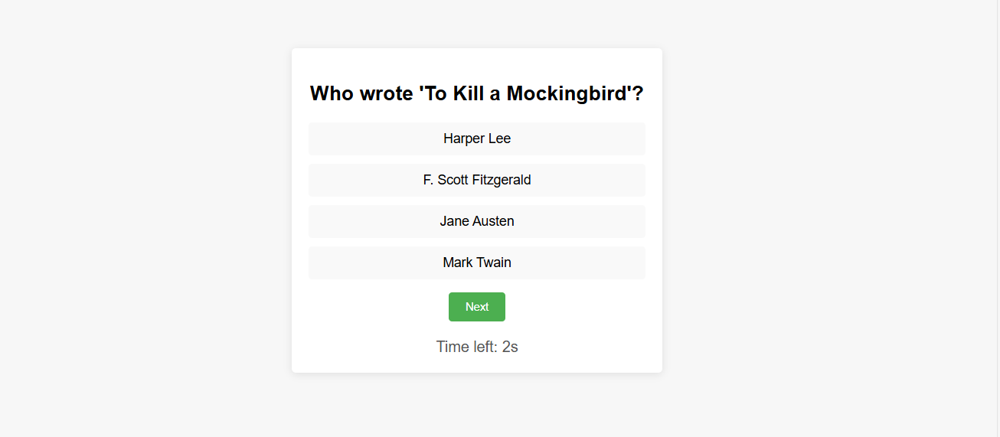

# Interactive Quiz Game

## Overview
This project is an interactive quiz game built using HTML, CSS, and JavaScript. The game features multiple-choice questions, a timer for each question, and real-time score tracking. Players are rewarded points for correct answers, and they receive feedback immediately after selecting an answer. At the end of the quiz, players can see their total score, the number of correct and incorrect answers, and review the correct answers for any questions they missed.

## Features
- **Randomized Questions**: The questions are shuffled each time the quiz is played, ensuring a unique experience for the player.
- **Timer**: Each question has a 15-second timer. If the time runs out, the player is prompted to restart the quiz.
- **Score Tracking**: Points are awarded for each correct answer, and the final score is displayed at the end.
- **Review Incorrect Answers**: After completing the quiz, players can review the correct answers for any questions they answered incorrectly.
- **Responsive Design**: The quiz interface is designed to be responsive, making it accessible on various devices.

## Screenshot


## Future Development
- **Question Bank Expansion**: Add more questions and categories to provide a more diverse quiz experience.
- **User Authentication**: Allow players to create accounts and track their scores over time.
- **Leaderboard**: Implement a leaderboard to display the top scores among players.
- **Improved UI/UX**: Enhance the user interface with animations and better feedback mechanisms.

## Getting Started

### Clone the Repository
```bash
git clone https://github.com/alexkamene/Interactive-Quiz-Game.git
